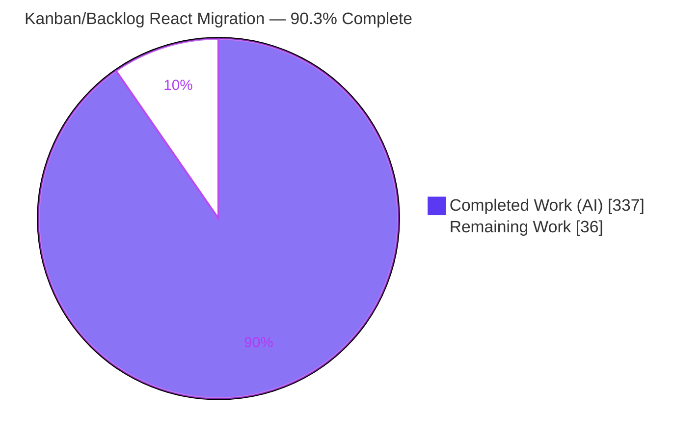
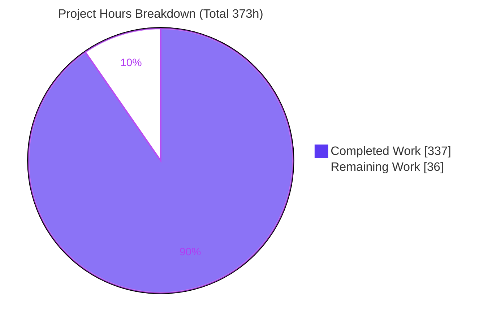
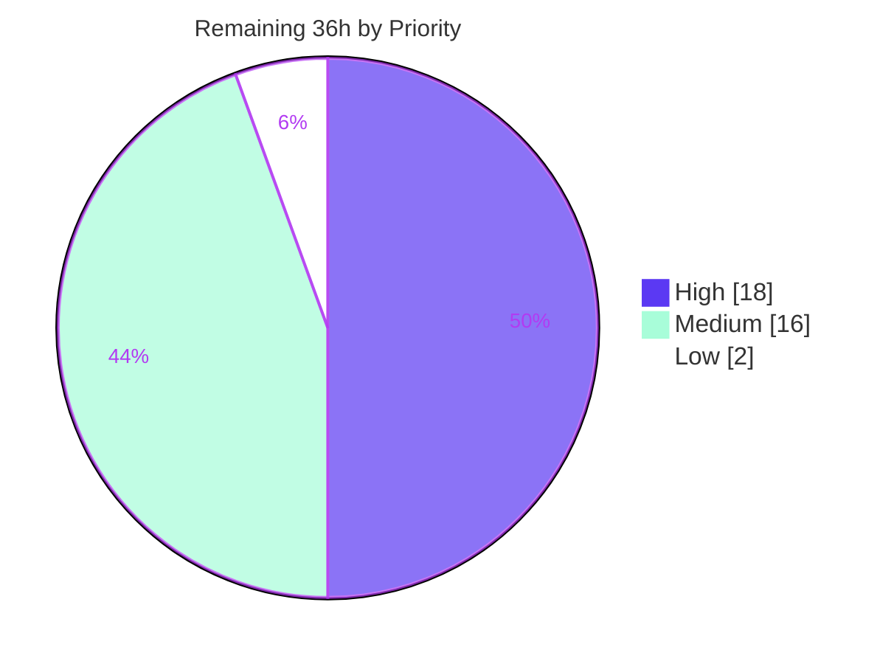

# Blitzy Project Guide
## Taiga — AngularJS → React 18 In-Place Migration (Kanban & Backlog)

---

## 1. Executive Summary

### 1.1 Project Overview

This project migrates exactly two `taiga-front` screens — the **Kanban/Taskboard** board and the **Backlog/Sprint-Planning** view — from **AngularJS 1.5.10** to **React 18**, running the new React screens **in-place** alongside the remainder of the still-AngularJS application. It is an incremental, de-risking "Strangler" migration served from a single origin (nginx, host port 9000). The React bundle loads before `angular.bootstrap` and mounts each screen as a Custom Element (`<tg-react-kanban>`, `<tg-react-backlog>`), reusing the repository's existing `elements.js` Web-Components precedent. There are no feature changes: the Django `/api/v1/` REST contract, the WebSocket event contract, and JWT/`X-Session-Id`/`my_permissions` security all remain byte-for-byte unchanged. Target users are Taiga project teams; the business impact is validating a broader migration path with zero behavioral risk to production.

### 1.2 Completion Status



> Legend — **Completed = Dark Blue (#5B39F3)**, **Remaining = White (#FFFFFF)**.
> Completion is computed on AAP-scoped + path-to-production hours only: **337 / (337 + 36) = 90.3%**.

| Metric | Hours |
|--------|-------|
| **Total Hours** | **373** |
| Completed Hours (AI + Manual) | 337 |
| — of which AI-autonomous | 337 |
| — of which Manual (human) | 0 |
| **Remaining Hours** | **36** |
| **Percent Complete** | **90.3%** |

### 1.3 Key Accomplishments

- ✅ **21 AngularJS files removed** exactly to scope (7 CoffeeScript controllers/directives, 10 Jade partials, 2 Protractor suites, 2 helpers); empty `taigaKanban`/`taigaBacklog` module declarations preserved so `app.coffee` deps/routes remain valid and untouched.
- ✅ **101 React/TypeScript files** (21,663 LOC) authored under `app/react/**`: shared infrastructure, Kanban + Backlog containers, immer reducers, `@dnd-kit` DnD contexts, and 21 presentational components.
- ✅ **Drag-and-drop parity** with dragula semantics via `@dnd-kit/core` (permission/archived gates, multi-card, identical bulk-update endpoints) plus new keyboard accessibility.
- ✅ **Coexistence bootstrap**: `app-loader.coffee` loads `react.js` after `elements.js` and before `app.js`/`angular.bootstrap`, using graceful `loadOptional` degradation.
- ✅ **Build reliability**: `gulp-imagemin` and its binary-CDN transitives fully removed; new esbuild `react` Gulp task wired into `deploy`/`default`/`watch`; `gulp deploy` runs **fully offline, zero CDN fetches**.
- ✅ **Jest unit layer**: 50 suites, **1120/1120 tests pass**, **94.2% line coverage** (threshold 70%) — independently reproduced.
- ✅ **Playwright e2e layer** with committed **before/after visual evidence** (120 screenshots + 18 recordings, 5 paired states) and byte-identical data fingerprints proving the seed-once directive.
- ✅ **Zero regressions**: legacy **Karma 474/474** specs for the other 106 screens still pass.
- ✅ **Step 0** parent-repo `taiga-front` submodule pointer bumped so the Dockerfile builds from local source.

### 1.4 Critical Unresolved Issues

| Issue | Impact | Owner | ETA |
|-------|--------|-------|-----|
| _None — zero in-scope code defects._ Compilation, unit tests, and offline build all pass; validation found no blocking issues. | No release-blocking code issues | — | — |
| Live Playwright e2e run not executed in the analysis environment (requires out-of-scope Docker stack) | Visual/behavioral fidelity proven by committed artifacts but not yet re-verified live | Human developer (HT-1) | ~12h |

> There are **no code-level blockers**. The single item above is a path-to-production verification, not an unresolved defect.

### 1.5 Access Issues

| System/Resource | Type of Access | Issue Description | Resolution Status | Owner |
|-----------------|----------------|-------------------|-------------------|-------|
| Taiga Docker stack (Postgres + Django + nginx :9000) | Runtime/infra | Docker not installed in the analysis environment; full stack could not be stood up, so live `npm run e2e` was not run here | Open — documented in HT-1; artifacts already committed | Human developer |
| Node runtime | Toolchain | Analysis host defaults to Node v22; project hard-pins v16.19.1 (available via nvm and used for all validation here) | Resolved — `nvm use v16.19.1` | Human developer |
| Debian buster base image | Build/infra | Node 16 base image is on EOL Debian buster; apt sources must be redirected to `archive.debian.org` to build the Docker image | Open — folded into HT-1 | Human developer |

### 1.6 Recommended Next Steps

1. **[High]** Stand up the full Taiga Docker stack on the pinned Node v16.19.1 base image (patch Debian buster → `archive.debian.org`), seed `sample_data` exactly once, and run `npm run e2e` live to reproduce the committed baseline/react artifacts (HT-1).
2. **[High]** Perform human visual-fidelity review and sign-off of the committed before/after evidence against `e2e-react/artifacts/MANIFEST.md` (HT-2).
3. **[Medium]** Run manual exploratory QA of behavior parity on a live board — multi-card DnD, swimlanes, WIP limits, archived/hidden/folded states, sidebar filters, sprint/milestone create+edit (HT-3).
4. **[Medium]** Validate production deployment — real Django backend, WebSocket live updates, JWT/`X-Session-Id` auth, and a cross-browser smoke beyond Firefox/Chromium-fallback (HT-4).
5. **[Low]** Accessibility spot-check of the new `@dnd-kit` keyboard DnD + ARIA announcements; optionally add telemetry for `react.js` load failures (HT-5).

---

## 2. Project Hours Breakdown

### 2.1 Completed Work Detail

All completed components trace to specific Agent Action Plan (AAP) deliverables (D1–D16).

| Component | Hours | Description |
|-----------|------:|-------------|
| React shared infrastructure `[D5]` | 44 | `shared/api` client (same-origin, `Authorization: Bearer` + `X-Session-Id`), session/JWT + `window.taigaConfig` bridge, WebSocket events bridge, permissions gates, hand-written sprint validation, domain types, custom-element mount utility, helpers (5,208 LOC). |
| React Kanban screen `[D6]` | 64 | `KanbanApp` container, immer `boardReducer` (`usByStatus`/`usByStatusSwimlanes`/`usMap`), `useKanbanBoard` hook, `@dnd-kit` DnD parity (dragula semantics, permission/archived gates, multi-card, `bulk_update_kanban_order`), 11 components (Swimlane, TaskboardColumn, Card, CardData, CardActions, CardAssignedTo, WipLimit, SquishColumn, ArchivedStatus*, FiltersSidebar) — 7,997 LOC. |
| React Backlog screen `[D7]` | 60 | `BacklogApp` container, immer `backlogReducer`, `useBacklog` hook, `@dnd-kit` DnD (`bulk_update_backlog_order` + `bulk_update_milestone`), CreateEditSprintLightbox + validation, BulkCreateUsLightbox, 10 components + burndown — 8,368 LOC. |
| Jest unit test suite `[D13]` | 60 | 50 spec files, 1120 tests, jsdom + ts-jest, 94.2% line coverage (25,465 LOC). |
| Playwright e2e + two-phase visual capture `[D12]` | 28 | 4 specs, 5 fixtures, `playwright.config.ts`, capture orchestration; committed 120 screenshots + 18 recordings, MANIFEST + sha256 manifest, byte-identical data fingerprints (2,766 LOC + artifacts). *(Completed portion; live re-run in §2.2.)* |
| Build & toolchain `[D8,D9,D10,D11]` | 22 | esbuild `react` Gulp task, `package.json` deps (exact AAP pins), `gulp-imagemin` removal, `tsconfig.json`/`jest.config.js`/`playwright.config.ts`, `index.tsx` entry registering custom elements. |
| Coexistence bootstrap & partial hosting `[D3,D4]` | 10 | `app-loader.coffee` `loadOptional` ordering (elements → react → app → bootstrap); 2 Jade partials updated to host `<tg-react-*>`; 10 screen-exclusive partials deleted. |
| AngularJS removal & legacy test cleanup `[D1,D2,D14]` | 8 | Delete 7 CoffeeScript files (keep empty module decls, `app.coffee` untouched); delete 2 Protractor suites + 2 helpers; update `e2e/helpers/index.js` aggregator. |
| Documentation `[D15]` | 3 | `README.md` Tests section: `npm test` → Jest, `ci:test` → Karma, `npm run e2e` → Playwright. |
| Step 0 submodule pointer bump `[D16]` | 3 | Parent-repo `taiga-front` gitlink bumped so `docker/Dockerfile` builds from source (`npm ci` + `gulp deploy`). |
| Code-review & QA hardening | 35 | 46 code-review findings + 23 QA findings + 7 visual-fidelity fixes (F-VIS-01..07) + cold-cache Jest fix + sprint-lightbox XSS fix + DnD offline-revert fixes, across 24 commits. |
| **Total Completed** | **337** | |

### 2.2 Remaining Work Detail

All remaining work is **path-to-production verification and human sign-off** — there are no in-scope code defects.

| Category | Hours | Priority |
|----------|------:|----------|
| Stand up Taiga Docker stack (Node16 base, Debian → archive) + run `npm run e2e` live to reproduce committed artifacts (HT-1) | 12 | High |
| Human visual-fidelity review & sign-off of before/after evidence (HT-2) | 6 | High |
| Manual exploratory QA of behavior parity on live board — DnD, swimlanes, WIP, archived/folded, filters, sprint CRUD (HT-3) | 8 | Medium |
| Production deployment validation — real backend/WebSocket, JWT auth, cross-browser smoke (HT-4) | 8 | Medium |
| Accessibility spot-check of `@dnd-kit` keyboard DnD + ARIA; optional load-failure telemetry (HT-5) | 2 | Low |
| **Total Remaining** | **36** | |

> **Reconciliation:** Section 2.1 (337) + Section 2.2 (36) = **373 Total Hours** (matches §1.2). Section 2.2 total (36) matches §1.2 Remaining Hours and the §7 pie "Remaining Work".

### 2.3 Notes on Estimation Confidence

- **High confidence:** completed React source, build wiring, unit tests, deletions, coexistence, docs, submodule bump — verified on disk and independently re-run.
- **Medium confidence:** the 36 remaining hours depend on standing up EOL-base Docker infrastructure; the Debian-archive patch step carries some environmental variability, which is reflected in the HT-1 estimate.

---

## 3. Test Results

All results below originate from Blitzy's autonomous validation logs; the Jest and compilation gates were **independently reproduced** during this assessment on the pinned Node v16.19.1.

| Test Category | Framework | Total Tests | Passed | Failed | Coverage % | Notes |
|---------------|-----------|------------:|-------:|-------:|-----------:|-------|
| Unit (React screens) | Jest 29.7.0 (jsdom + ts-jest) | 1120 | 1120 | 0 | 94.2 (lines) | 50 suites; browserless; threshold 70% met (94.23% stmts / 83.57% branch / 92.16% funcs). Independently reproduced. |
| Legacy Regression (106 other screens) | Karma 0.13 (ChromeHeadlessCI) | 474 | 474 | 0 | n/a | Confirms in-scope deletions caused zero regression. |
| Type Check (compilation gate) | TypeScript 5.4.5 `tsc --noEmit` (strict) | 1 gate | Pass | 0 | n/a | Zero errors over `app/react/**`. Independently reproduced. |
| Offline Build gate | Gulp 4 + esbuild 0.21.5 | 1 gate | Pass | 0 | n/a | `gulp deploy` completes in ~1.1 min with zero external CDN fetches. |
| Runtime Mount gate | jsdom harness | 1 gate | Pass | 0 | n/a | Both custom elements register; `connectedCallback` renders; `disconnectedCallback` unmounts cleanly. |
| E2E (Kanban/Backlog) | Playwright 1.44.1 (Firefox) | — | — | — | — | Test code + committed before/after artifacts (120 screenshots + 18 recordings) present; **live run pending the Docker stack (HT-1)** — no pass/fail asserted here to preserve log integrity. |

**Totals from autonomous logs:** 1594 executed tests (1120 Jest + 474 Karma), **100% pass**, plus 3 pass/fail gates (compilation, offline build, runtime mount).

---

## 4. Runtime Validation & UI Verification

**Runtime health**
- ✅ **Operational** — esbuild bundle `dist/js/react.js` builds (340 KB minified) and registers `tg-react-kanban` + `tg-react-backlog`.
- ✅ **Operational** — `connectedCallback` runs `createRoot(this).render(...)` producing React DOM in each host; `disconnectedCallback` calls `root.unmount()` cleanly (validated on both minified and non-minified bundles).
- ✅ **Operational** — `app-loader.coffee` load order intact: `elements.js` → `react.js` → `app.js` → `angular.bootstrap`, with `loadOptional` so a `react.js` failure degrades gracefully rather than blanking the app.
- ✅ **Operational** — compiled `app.js` confirms post-migration source (0 `KanbanController`/`BacklogController` refs; empty `taigaKanban`/`taigaBacklog` module declarations preserved).

**UI verification (committed evidence)**
- ✅ **Operational** — 5 before/after 1280×800 pairs committed under `e2e-react/artifacts/{baseline,react}/` (Kanban swimlanes + WIP; Backlog sprints; empty states), indexed in `MANIFEST.md` with sha256 integrity hashes.
- ✅ **Operational** — data fingerprint `RECHECK.md` proves the PostgreSQL volume was byte-identical across both capture phases (seed-once directive honored).
- ⚠ **Partial** — live in-browser re-run of the captures against a running stack is **pending HT-1** (out-of-scope Docker infrastructure).

**API / integration outcomes**
- ✅ **Operational** — `shared/api/client.ts` enforces same-origin `/api/v1/` requests with `Authorization: Bearer` + `X-Session-Id` (unit-tested; CR #6/#28).
- ⚠ **Partial** — live WebSocket updates (`changes.project.{id}.userstories/.milestones/.projects`) verified by unit tests and the events bridge design; **live confirmation pending HT-4**.

---

## 5. Compliance & Quality Review

| AAP Deliverable / Benchmark | Status | Progress | Notes / Fixes Applied |
|-----------------------------|--------|----------|-----------------------|
| D1 — Delete 7 AngularJS CoffeeScript files | ✅ Pass | 100% | All 7 removed; verified via git. |
| D2 — Keep empty module decls; `app.coffee` untouched | ✅ Pass | 100% | `taigaKanban`/`taigaBacklog` empty modules kept; `app.coffee` diff empty. |
| D3 — Update 2 Jade partials; delete 10 | ✅ Pass | 100% | Hosts `<tg-react-*>`; no dangling includes. |
| D4 — `app-loader.coffee` loads `react.js` pre-bootstrap | ✅ Pass | 100% | `loadOptional` order verified. |
| D5 — React shared infrastructure | ✅ Pass | 100% | Compiles (strict); covered by Jest. |
| D6 — React Kanban screen | ✅ Pass | 100% | DnD parity, swimlanes, WIP, filters. |
| D7 — React Backlog screen | ✅ Pass | 100% | Sprints, lightboxes, burndown, DnD-to-milestone. |
| D8 — `index.tsx` custom-element entry | ✅ Pass | 100% | Registers both elements. |
| D9 — `package.json` deps + scripts; remove imagemin | ✅ Pass | 100% | Exact AAP pins; `gulp-imagemin` = 0 refs in manifest + lockfile. |
| D10 — `gulpfile.js` esbuild react task; wire in | ✅ Pass | 100% | Task at line 596; wired into deploy/default/watch. |
| D11 — `tsconfig`/`jest.config`/`playwright.config` | ✅ Pass | 100% | Present and functional. |
| D12 — `e2e-react/**` tests + committed artifacts | ⚠ Partial | ~80% | Code + artifacts committed; live run pending (HT-1). |
| D13 — Jest unit specs (≥70% lines) | ✅ Pass | 100% | 94.2% lines, 1120 tests. |
| D14 — Delete Protractor suites; update helpers | ✅ Pass | 100% | Suites/helpers removed; aggregator cleaned. |
| D15 — `README.md` Tests section | ✅ Pass | 100% | Documents Jest/Karma/Playwright. |
| D16 — Step 0 submodule pointer bump | ✅ Pass | 100% | Parent gitlink = HEAD; builds from source. |
| **Minimal Change Clause** — retain dragula/dom-autoscroller/immutable/checksley | ✅ Pass | 100% | All retained (out-of-scope screens depend on them). |
| **Contract preservation** — `/api/v1/` + WebSocket unchanged | ✅ Pass | 100% | Same endpoints/routing keys; React indistinguishable from AngularJS to backend. |
| **Security parity** — JWT / `X-Session-Id` / `my_permissions` | ✅ Pass | 100% | Reimplemented in shared client + permissions; XSS in sprint lightbox found & fixed. |
| **Node v16.19.1 compatibility** | ✅ Pass | 100% | Toolchain runs on the hard-pinned runtime. |

**Fixes applied during autonomous validation:** 46 code-review findings, 23 QA findings, 7 visual-fidelity findings (F-VIS-01..07), a cold-cache Jest failure, a sprint-lightbox XSS, and DnD offline-revert issues — all resolved and committed.
**Outstanding:** live e2e re-run and human sign-off (path-to-production, §2.2).

---

## 6. Risk Assessment

| Risk | Category | Severity | Probability | Mitigation | Status |
|------|----------|----------|-------------|------------|--------|
| Live DnD parity not verified end-to-end vs a real backend | Technical | Medium | Low–Med | Unit tests + committed captures; run manual QA (HT-3) | Mitigated |
| `react.js` is `loadOptional` → screen shows "unavailable" if bundle path/version wrong in prod | Technical | Medium | Low | Verify dist versioned path; graceful degradation by design | Mitigated by design |
| WebSocket live-update bridge unverified under real `taiga-events` | Technical | Low–Med | Low | Production deployment validation (HT-4) | Open (path-to-prod) |
| Node v16.19.1 is EOL — no upstream security patches | Technical | Low | Low | AAP hard-pin matching other screens; broader upgrade is a separate effort | Accepted |
| Same-origin + Bearer/`X-Session-Id` reimplemented in `client.ts` | Security | High (impact) | Low | Unit-tested (CR #6/#28); prod smoke (HT-4) | Mitigated |
| Sprint-lightbox XSS | Security | Medium | Low | Found & fixed in QA; React auto-escapes | Resolved |
| JWT/session read from AngularJS shell | Security | Low | Low | No new token storage; shared runtime | Mitigated |
| `dist/` is gitignored → prod depends on `gulp deploy` emitting `react.js` | Operational | Medium | Low | React task wired into deploy; validated offline; enforce CI build gate | Mitigated |
| No telemetry for `react.js` load failures (hidden by graceful degradation) | Operational | Low–Med | Med | Add client-side error monitoring (HT-5) | Open (path-to-prod) |
| imagemin removal → unoptimized images for all screens | Operational | Low | Low | AAP-sanctioned build-tooling change; pure-WASM codec fallback available | Accepted |
| E2E needs full Docker stack on patched Node16 base (not available in analysis env) | Integration | Medium | Med | Documented setup; artifacts committed; run live before release (HT-1) | Open (path-to-prod) |
| Cross-browser limited to Firefox primary + Chromium fallback | Integration | Low–Med | Med | Add cross-browser smoke in prod validation (HT-4) | Open |
| Backend `/api/v1/` + WebSocket contract dependency | Integration | Low | Low | Contract pinned/out-of-scope; React mirrors AngularJS | Accepted |

---

## 7. Visual Project Status

**Overall hours (Completed vs Remaining)** — Completed = Dark Blue (#5B39F3), Remaining = White (#FFFFFF).



**Remaining work by priority** (High = 18h, Medium = 16h, Low = 2h; sum = 36h).



**Remaining hours per category (Section 2.2):**

| Category | Hours |
|----------|------:|
| Docker stack + live e2e (HT-1) | 12 |
| Visual-fidelity sign-off (HT-2) | 6 |
| Manual behavior-parity QA (HT-3) | 8 |
| Production deployment validation (HT-4) | 8 |
| Accessibility spot-check (HT-5) | 2 |
| **Total** | **36** |

> **Integrity:** the pie "Remaining Work" (36) equals §1.2 Remaining Hours (36) and the §2.2 Hours sum (36).

---

## 8. Summary & Recommendations

**Achievements.** The AngularJS 1.5.10 → React 18 in-place migration of the Kanban and Backlog screens is functionally complete and validated. Every in-scope AAP deliverable except live e2e re-verification is fully delivered: 21 AngularJS files removed exactly to scope, 101 React/TypeScript files (21,663 LOC) authored, drag-and-drop parity achieved with `@dnd-kit`, the coexistence bootstrap wired, `gulp-imagemin` removed for a fully-offline build, and a comprehensive Jest suite (1120 tests, 94.2% coverage) added alongside committed before/after visual evidence. Legacy Karma (474 tests) confirms zero regression to the other 106 screens.

**Remaining gaps.** The project is **90.3% complete** (337 of 373 hours). The remaining **36 hours are entirely path-to-production**: standing up the full Taiga Docker stack for a live `npm run e2e` run, human visual-fidelity sign-off, manual behavior-parity QA, production deployment validation, and an accessibility spot-check. **There are no in-scope code defects** — compilation, unit tests, and the offline build were independently reproduced and pass cleanly.

**Critical path to production.** (1) HT-1 — stand up the Docker stack (patch the EOL Debian base to `archive.debian.org`) and run e2e live; (2) HT-2 — sign off the visual evidence; (3) HT-4 — validate a real deployment (backend, WebSocket, cross-browser). HT-3 and HT-5 can proceed in parallel.

**Success metrics.** Unit coverage 94.2% (target 70%) ✅; 1120/1120 unit + 474/474 legacy pass ✅; offline build with zero CDN fetches ✅; contract + security parity preserved ✅.

**Production readiness assessment.** **Conditionally ready.** The code is production-grade and regression-free; final release is gated only on the ~36 hours of live verification and human sign-off above.

| Metric | Value |
|--------|-------|
| AAP-scoped completion | **90.3%** (337 / 373h) |
| In-scope code defects | 0 |
| Unit tests | 1120/1120 pass, 94.2% coverage |
| Legacy regression | 474/474 pass |
| Remaining effort | 36h (path-to-production) |

---

## 9. Development Guide

> All non-Docker commands below were tested during this assessment on the pinned Node **v16.19.1**. Run everything from the `taiga-front/` submodule directory unless noted.

### 9.1 System Prerequisites

- **Node.js v16.19.1** (hard pin — see `.nvmrc`). Node ≥ 18 breaks Playwright 1.44 and the pinned toolchain.
- **npm 8.19.3** (ships with Node 16.19.1).
- **nvm** (to select the pinned Node).
- **Docker + docker compose** (only for the e2e / live-stack steps).
- Linux/macOS; a small `/dev/shm` requires Chrome flags (handled by the config).

### 9.2 Environment Setup

```bash
# From the taiga-front submodule
nvm install v16.19.1        # if not already installed
nvm use v16.19.1
node --version              # -> v16.19.1
npm --version               # -> 8.19.3
```

Environment variables (used by the e2e layer):

```bash
export TAIGA_ADMIN_PASSWORD=admin123          # MUST match createsuperuser & every test login
export TAIGA_FRONT_URL=http://localhost:9000/ # nginx gateway (Playwright baseURL)
# export TAIGA_E2E_CHROMIUM=1                  # opt-in Chromium fallback (else Firefox only)
```

### 9.3 Dependency Installation

```bash
cd taiga-front
npm ci        # installs ~1227 packages; gulp-imagemin removed, so no binary-CDN hang
```

### 9.4 Build

```bash
npx gulp react     # esbuild bundle only -> dist/v-<ts>/js/react.js   (tested: exit 0, ~0.1s)
npx gulp deploy    # full offline production build (coffee/jade/scss + react + minify)
```

### 9.5 Unit Tests & Type Check

```bash
node_modules/.bin/tsc --noEmit -p tsconfig.json   # strict type check (tested: exit 0)
npm test                                           # Jest: 50 suites, 1120 tests (tested: pass, 94.2% cov)
npm run ci:test                                    # legacy Karma regression (474 specs)
```

### 9.6 E2E Tests (requires the live Docker stack)

```bash
# 1) Bring up the full Taiga stack (from taiga-docker/)
cd ../taiga-docker
./launch-taiga.sh                    # Postgres + Django + nginx :9000 (+ events/protected/async)

# 2) Seed sample data EXACTLY ONCE (never reseed between baseline & react captures)
./taiga-manage.sh sample_data

# 3) Run the React e2e suite (Firefox is the sole default engine)
cd ../taiga-front
npm run e2e                          # Playwright vs http://localhost:9000/
npm run e2e:chromium                 # opt-in Chromium fallback (--no-sandbox --disable-dev-shm-usage)
```

### 9.7 Verification Steps

- `tsc --noEmit` exits 0 (zero type errors).
- `npm test` reports `Test Suites: 50 passed`, `Tests: 1120 passed`, coverage ≥ 70% lines.
- `gulp react` produces `dist/v-<timestamp>/js/react.js` containing `customElements.define('tg-react-kanban', …)` and `('tg-react-backlog', …)`.
- After `launch-taiga.sh`, `curl -sI http://localhost:9000/` returns HTTP 200 and the Kanban/Backlog routes render the React custom elements.

### 9.8 Troubleshooting

- **`npm test` picks up e2e specs / launches a browser** → it should not; `jest.config.js` `testMatch` is confined to `app/react/**/__tests__/**`. Ensure you did not add e2e globs.
- **Kanban/Backlog screen shows "unavailable" but the rest of the app works** → `react.js` failed to load (`loadOptional` degradation). Confirm `dist/v-<ts>/js/react.js` exists and the version path matches `window._version`.
- **`npm ci` hangs on install** → ensure you are on this branch (imagemin removed); the legacy hang came from `gulp-imagemin` binary-CDN fetches.
- **Docker image fails to build on Node 16 base** → the Debian buster base is EOL; redirect apt sources to `archive.debian.org` before `apt-get`.
- **Wrong Node version** → run `nvm use` (reads `.nvmrc` → v16.19.1). Node ≥ 18 breaks Playwright 1.44.
- **e2e login fails** → `TAIGA_ADMIN_PASSWORD` must equal the value used at `createsuperuser` (fallback `admin123`).

---

## 10. Appendices

### A. Command Reference

| Command | Purpose |
|---------|---------|
| `nvm use v16.19.1` | Select the pinned Node runtime |
| `npm ci` | Install exact locked dependencies |
| `npx gulp react` | esbuild-bundle the React screens → `react.js` |
| `npx gulp deploy` | Full offline production build |
| `npx gulp` (default) / `npx gulp watch` | Dev build / watch (includes `react`) |
| `tsc --noEmit -p tsconfig.json` | Strict TypeScript type check |
| `npm test` | Jest unit tests (jsdom, browserless) |
| `npm run ci:test` | Legacy Karma regression suite |
| `npm run e2e` | Playwright e2e (Firefox) — needs live stack |
| `npm run e2e:chromium` | Playwright e2e Chromium fallback |
| `npm run scss-lint` | SCSS lint gate (pre-commit) |
| `./launch-taiga.sh` / `./taiga-manage.sh sample_data` | Bring up stack / seed once (taiga-docker) |

### B. Port Reference

| Port | Service |
|------|---------|
| 9000 | nginx gateway (serves the single deployable client; Playwright `baseURL`) |
| — | Postgres, RabbitMQ, taiga-events/protected/async run within the Docker network |

### C. Key File Locations

| Path | Role |
|------|------|
| `app/react/index.tsx` | esbuild entry; registers custom elements |
| `app/react/shared/mount.tsx` | `customElements.define` + `createRoot` host wrapper |
| `app/react/shared/api/client.ts` | `/api/v1/` client (Bearer + `X-Session-Id`) |
| `app/react/kanban/**`, `app/react/backlog/**` | Screen containers, reducers, DnD, components, specs |
| `app-loader/app-loader.coffee` | Load order (elements → react → app → bootstrap) |
| `gulpfile.js` (line ~596) | esbuild `react` task |
| `tsconfig.json` / `jest.config.js` / `jest.setup.js` | TS + Jest config |
| `e2e-react/playwright.config.ts` | Playwright config (Firefox primary) |
| `e2e-react/artifacts/{baseline,react}/**` | Committed before/after visual evidence |
| `e2e-react/artifacts/MANIFEST.md` / `manifest.json` | Evidence index + sha256 hashes |

### D. Technology Versions

| Tool | Version | Disposition |
|------|---------|-------------|
| react / react-dom | 18.2.0 | Added |
| typescript | 5.4.5 | Added (dev) |
| esbuild | 0.21.5 | Added (dev) |
| @dnd-kit/core | 6.3.1 | Added |
| immer | 10.1.1 | Added |
| jest / jest-environment-jsdom | 29.7.0 | Added (dev) |
| ts-jest | 29.1.2 | Added (dev) |
| @playwright/test | 1.44.1 | Added (dev) |
| @testing-library/react / jest-dom | 14.3.1 / 6.9.1 | Added (dev) |
| gulp-imagemin | (removed) | **Removed** (build reliability) |
| dragula / dom-autoscroller / immutable / checksley | retained | Retained (out-of-scope screens) |
| node / npm | 16.19.1 / 8.19.3 | Hard pin |
| gulp / coffeescript / node-sass / karma | 4.0.2 / 1.x / 8.0.0 / 0.13.x | Retained |

### E. Environment Variable Reference

| Variable | Default | Purpose |
|----------|---------|---------|
| `TAIGA_ADMIN_PASSWORD` | `admin123` | Superuser + every e2e login (identical by construction) |
| `TAIGA_FRONT_URL` | `http://localhost:9000/` | Playwright `baseURL` |
| `TAIGA_E2E_CHROMIUM` | (unset) | `=1` enables the Chromium fallback project |
| `CAPTURE_PHASE` | (unset) | Selects `baseline` vs `react` capture output |

### F. Developer Tools Guide

- **Type checking:** `tsc --noEmit -p tsconfig.json` (strict; the TS lint gate — no ESLint config by design).
- **Unit debugging:** `npm test -- --watch=false <path>` to target a single spec; coverage in `coverage/` (gitignored).
- **Bundle inspection:** the esbuild sourcemap alongside `react.js` maps back to all `app/react` sources.
- **SCSS lint:** `npm run scss-lint` (pre-commit hook; must exit 0).
- **e2e artifacts:** review `e2e-react/artifacts/report/` and the per-flow PNG frames + Playwright `.webm` recordings.

### G. Glossary

| Term | Meaning |
|------|---------|
| **Strangler migration** | Incrementally replacing parts of a system in-place while the rest keeps running. |
| **Custom Element / Web Component** | Browser-native element (`<tg-react-*>`) that hosts a React root inside the AngularJS shell. |
| **`loadOptional`** | Loader helper that lets an enhancement bundle (`react.js`) fail without blanking the app. |
| **Seed-once** | Seeding `sample_data` exactly once so baseline and React captures share an identical DB. |
| **WIP limit** | Work-in-progress cap per Kanban column, with conditional coloring. |
| **Swimlane** | Horizontal grouping of Kanban rows by a status/attribute. |
| **Two-phase capture** | Baseline (AngularJS) captured before removal, React captured after — committed for before/after review. |
